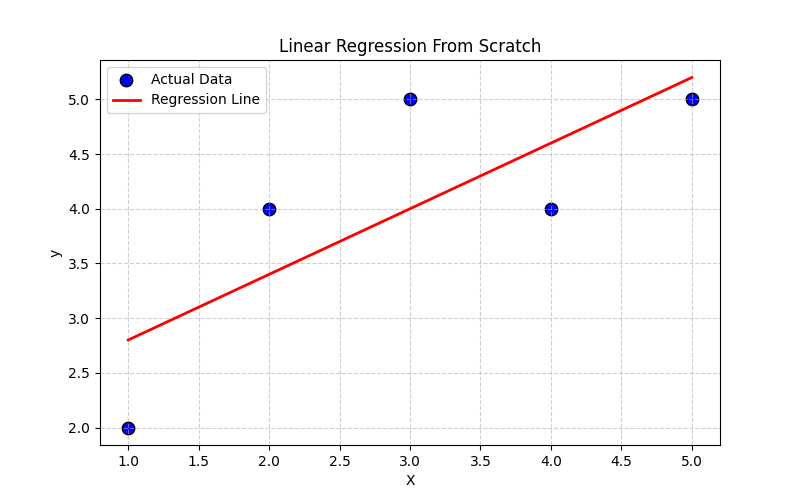
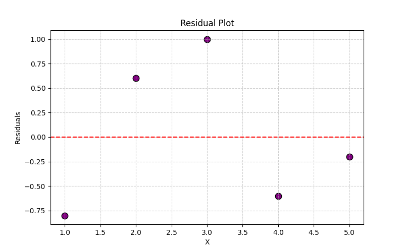

# Linear Regression from First Principles: Derivation, Implementation, and Analysis

This project reconstructs Ordinary Least Squares (OLS) Linear Regression entirely from first principles, covering both theoretical derivation and practical implementation.

## What this project does

- Derives the linear regression model by minimizing Mean Squared Error (MSE)
- Implements the model from scratch without using machine learning libraries
- Visualizes the fitted regression line against observed data
- Analyzes residual behavior to evaluate model adequacy
- Examines error through Mean Squared Error
- Validates the implementation against a standard library (Scikit-Learn)

---

## Theoretical Foundation

The regression model is derived by solving an optimization problem:

$$
J(m, b) = \frac{1}{n} \sum (y_i - (mx_i + b))^2
$$

The optimal parameters are obtained analytically as:

$$
m = \frac{\sum (x_i - \bar{x})(y_i - \bar{y})}{\sum (x_i - \bar{x})^2}, \quad
b = \bar{y} - m\bar{x}
$$

Full derivation:  
→ [`theory/derivation.md`](theory/derivation.md)

---

## Results

### Regression Fit



### Residual Analysis



---

## Key Insights

- Linear regression emerges naturally from an optimization framework
- Mean Squared Error provides a smooth, convex objective function
- Residual analysis is essential for evaluating model assumptions
- Analytical solutions can be validated through numerical implementation

---

## Structure

```
├── notebooks/
│   └── linear_regression_from_scratch.ipynb
├── theory/
│   └── derivation.md
├── images/
│   ├── regression_plot.png
│   └── residual_plot.png
```


---

## Why this project

This work focuses on understanding machine learning models beyond library usage, emphasizing derivation, interpretation, and validation.
It is intended as a foundational step toward more advanced models and optimization-based learning methods.
